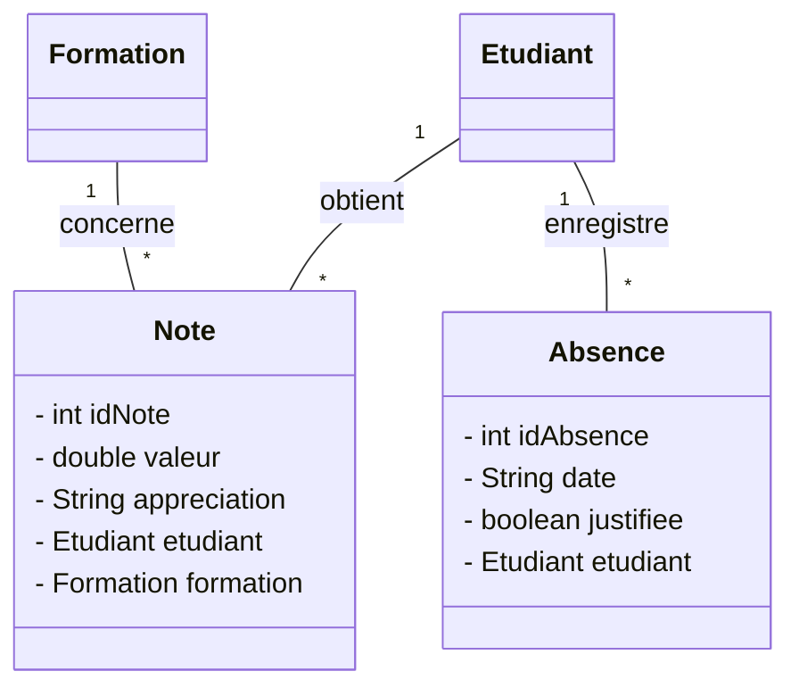

# Organisation du Travail en Équipe (Projet MVC)

Ce document décrit la méthode de répartition des tâches pour **2 ou 3 développeurs** afin de développer le projet sans générer de conflits Git.

---

## 1. Règle d'or Anti-Conflit Git

Un conflit Git survient uniquement lorsque deux développeurs modifient **le même fichier au même moment**. 
Pour éviter tout conflit :
* Chaque développeur est responsable de **fichiers et packages distincts**.
* Le fichier principal `App.java` ne doit pas être modifié en parallèle.

---

## 2. Option A : Découpage pour 2 Développeurs

### 👤 Développeur 1 : Module "Utilisateurs & Personnes"
* **Modèles (`src/model/`)** : `Utilisateur.java`, `Etudiant.java`, `Formateur.java`
* **Repositories (`src/repository/`)** : `UtilisateurRepository.java`, `EtudiantRepository.java`, `FormateurRepository.java`
* **Contrôleurs (`src/controller/`)** : `UserController.java`, `EtudiantController.java`, `FormateurController.java`
* **Vues (`src/view/`)** : `UserView.java`, `EtudiantView.java`, `FormateurView.java`

### 📚 Développeur 2 : Module "Formations & Inscriptions"
* **Modèles (`src/model/`)** : `Formation.java`, `Inscription.java`
* **Repositories (`src/repository/`)** : `FormationRepository.java`, `InscriptionRepository.java`
* **Contrôleurs (`src/controller/`)** : `FormationController.java`, `InscriptionController.java`
* **Vues (`src/view/`)** : `FormationView.java`, `InscriptionView.java`

---

## 3. Option B : Découpage pour 3 Développeurs (Extension UML)

Pour adapter le projet à **3 développeurs**, nous ajoutons deux nouvelles entités métier à la conception UML : **`Note` / `Evaluation`** et **`Absence`**.



### 👤 Développeur 1 : Module "Utilisateurs & Profils"
* **Modèles** : `Utilisateur.java`, `Etudiant.java`, `Formateur.java`
* **Repositories** : `UserRepository.java`, `EtudiantRepository.java`, `FormateurRepository.java`
* **Contrôleurs & Vues** : `UserController`, `EtudiantController`, `UserView`, `EtudiantView`

### 📚 Développeur 2 : Module "Formations & Inscriptions"
* **Modèles** : `Formation.java`, `Inscription.java`
* **Repositories** : `FormationRepository.java`, `InscriptionRepository.java`
* **Contrôleurs & Vues** : `FormationController`, `InscriptionController`, `FormationView`, `InscriptionView`

### 📝 Développeur 3 : Module "Évaluations (Notes) & Suivi (Absences)"
* **Modèles** : `Note.java`, `Absence.java`
* **Repositories** : `NoteRepository.java`, `AbsenceRepository.java`
* **Contrôleurs** : `NoteController.java`, `AbsenceController.java`
* **Vues** : `NoteView.java`, `AbsenceView.java`

---

## 4. Stratégie Git & Branches

1. **Création des branches de fonctionnalités** :
   * Développeur 1 : `git checkout -b feature/utilisateurs`
   * Développeur 2 : `git checkout -b feature/formations`
   * Développeur 3 : `git checkout -b feature/notes-absences`

2. **Flux de travail au quotidien** :
   ```bash
   # 1. Récupérer les dernières mises à jour du projet
   git checkout master
   git pull origin master

   # 2. Revenir sur sa branche et intégrer le master
   git checkout feature/nom-de-ma-branche
   git merge master

   # 3. Travailler, commiter et pusher
   git add .
   git commit -m "Description des modifications"
   git push origin feature/nom-de-ma-branche
   ```

3. **Fusion finale sur `master`** :
   * Une fois le module terminé, effectuez un `git merge` ou une Pull Request vers la branche `master`.

---

## 5. Test et Intégration dans `App.java`

Pour éviter de bloquer `App.java` :
* Chaque développeur crée une classe de test locale (ex: `TestUtilisateur.java`, `TestFormation.java`, `TestNote.java`).
* À la fin des modules, un seul développeur rassemble les appels dans `App.java`.
